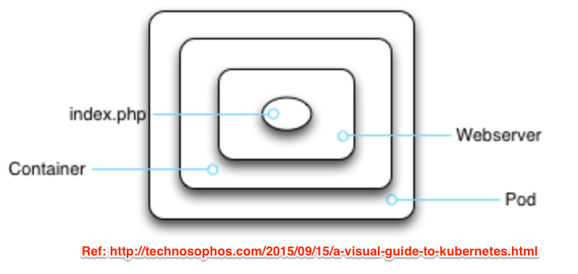
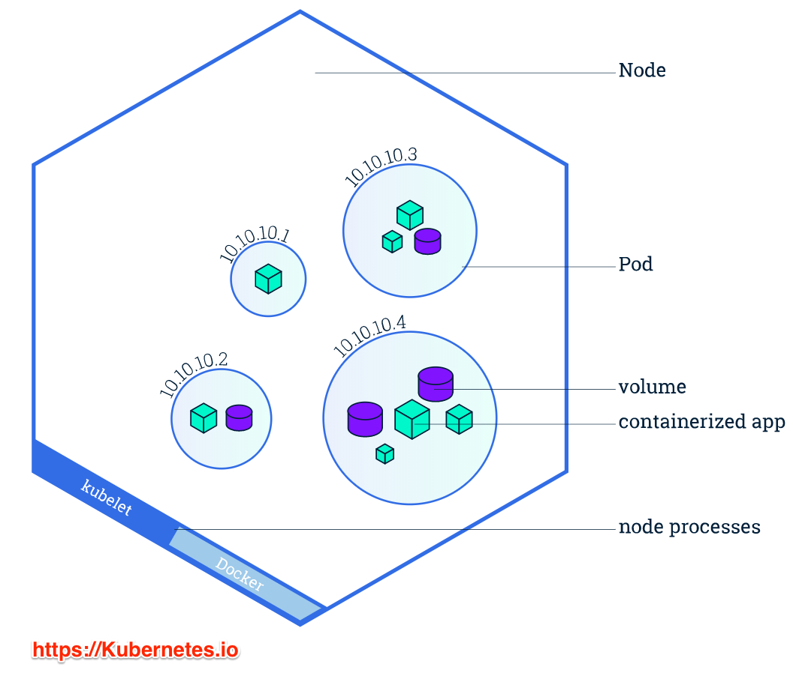
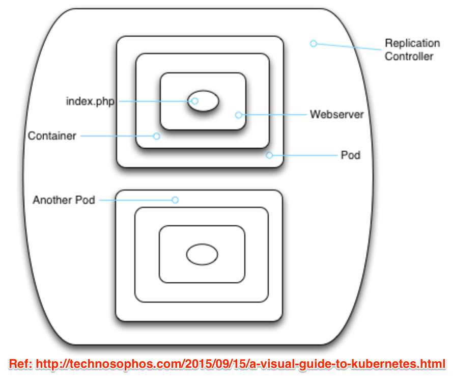
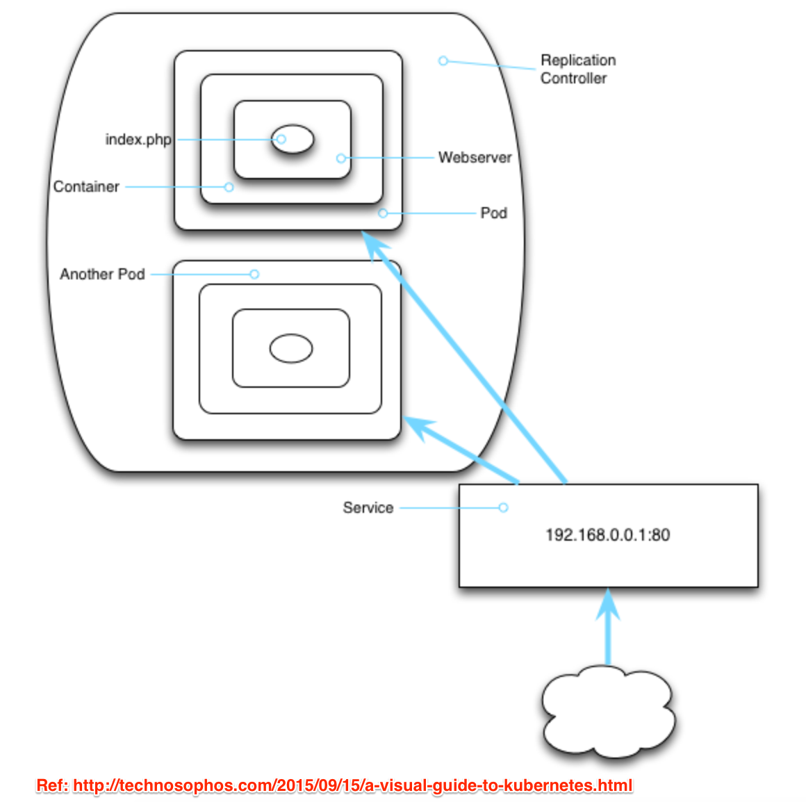
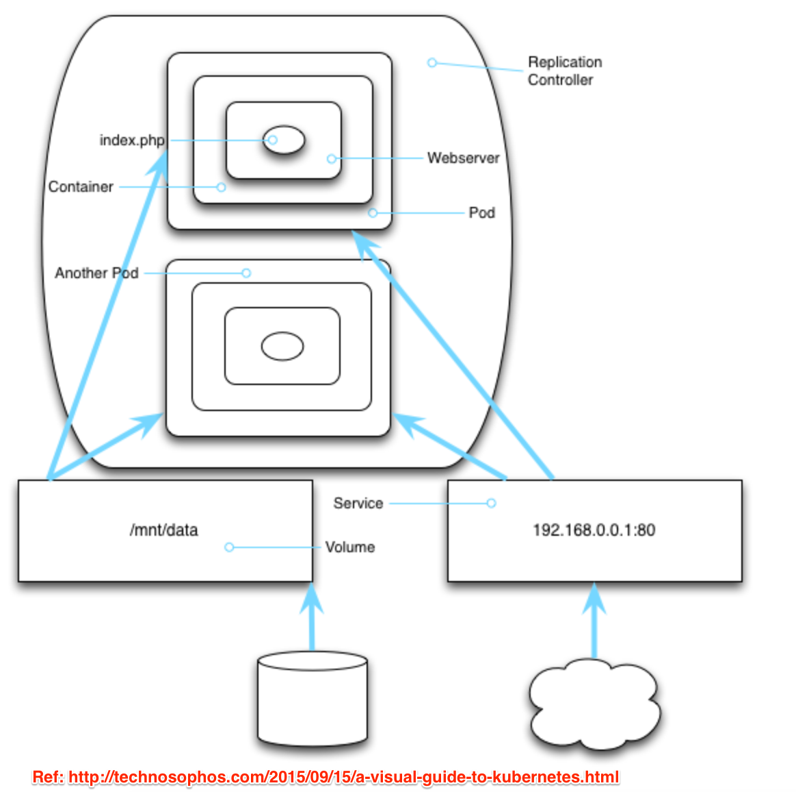
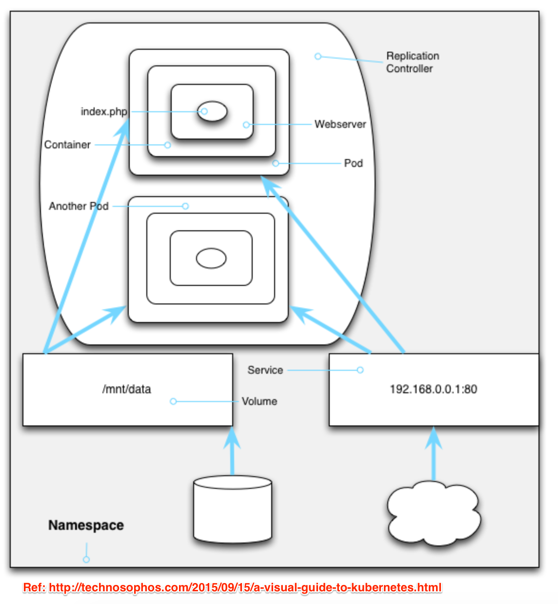

## Setup Kubernetes
Installing and setting up a Kubernetes on a local machine.

### Install kubectl
Install the Kubernetes command-line tool called kubectl to deploy and manage
applications on Kubernetes.

For macOS: `brew install kubernetes-cli`

### Configure kubectl 
`vim ~/.kube/config`
```yml
apiVersion: v1
clusters:
- cluster:
    certificate-authority: /Users/damber/k8s/prod_ca.pem
    server: https://203.119.108.20:6443
  name: prod

...

  user:
    client-certificate: /Users/damber/k8s/cert.pem
    client-key: /Users/damber/k8s/key.pem
```
We need to create `certificate-authority`, `client-certificate` and `client-key`
keys as mentioned in config file.
- Create folder `k8s` in home directory
- Create certificate authority `touch k8s\prod_ca.pem` and add digital 
certificate to certify the ownership of a public key.
- Create client certificate using your certificate to make authenticated 
request to a remote server.

  `openssl pkcs12 -in <YOUR_CERTIFICATE>.p12 -out cert.pem -nodes -nokeys`

- Create client key 

  `openssl pkcs12 -in <YOUR_CERTIFICATE>.p12 -out key.pem -nodes -nocerts`

### Verify kubectl
`kubectl version`

`kubectl cluster-info`

## Terminology 
### 1. Pods
A Pod is a logical wrapper around running containers which hold an application.
For example, a Pod may have mysql database container, microservices container,
and wordpress container running together as an application.



### 2. Nodes
Node is a worker machine in Kubernetes, managed by the Master. 
- Node can have multiple pods
- Node can have multiple clusters
- Each pod is tied to the Node where it is scheduled by the Master and in case 
of a Node failure, the pods are scheduled on other available Nodes in the
cluster.

**Node Components:**
 - Kubelet Service: It enable communication between Kubernetes master and the 
 node to receive commands and work. It also manages network rules and port etc.
 - Docker: Pull the container image from a registry, unpack them, and run the
   application.
 - Kube Proxy Service: It runs on each node making services available to the
   external host. Basically, it manages networking part for nodes.

   

### 3. Replication Controllers
Replication controllers ensure that a specific number of pod replicas are
running at any one time. It manages cluster (group of pods), scale up cluster (by
creating extra pod copies), scale down cluster (by removing a few copies). It
can monitor each pod and if one is unresponsive or misbehave, it can kill that
one and bring on a suitable replacement.



### 4. Services
Services defines a logical set of Pods and a policy by which to access them over 
the network. For example, a service preserves IP addresses and ports so that DNS
names can map to the same thing.



### 5. Volume
A place to store data that lives longer than a pod for an application.



### 6. Namespaces
A way of encapsulating pods, replication controllers, services and volumes into
big group called namespace. It isolate its contents from everybody's stuff. 



### 7. Deployment
To deploy your containerized applications you need to create a Kubernetes Deployment configuration. It instructs Kubernetes how to create/update instances of your application, generate pods and connect to other services. When we create a deployment on kubernetes, it creates pods with containers inside them. 

### 8. Secret 
A secret hold sensitive information such as passowords, OAuth token, and ssh keys. It allow for more control, secure and flexible storage of sensitive information.

### 9. PVC
PersistentVolume (PV) provides an API for users and administrators that abstracts details of how storage is provided from how it is consumed.

PersistantVolumeClaim (PVC) is a request for storage by a user. It is similar to a pod. Pods consume node resources and PVCs consume PV resources.

### 10. Quota
It's useful to know about the aggregate resource consumption per namespace as you will at times check if the namespace has enough computational resources for your pod.

- Get quota name `kubectl get quota`
- Describe `kubectl describe quota <quota-name>`
```
Name:            compute-resources
Namespace:       webops-uat
Resource         Used    Hard
--------         ----    ----
limits.cpu       1850m   4
limits.memory    3584Mi  8Gi
pods             4       8
requests.cpu     1200m   2
requests.memory  2560Mi  4Gi
```
