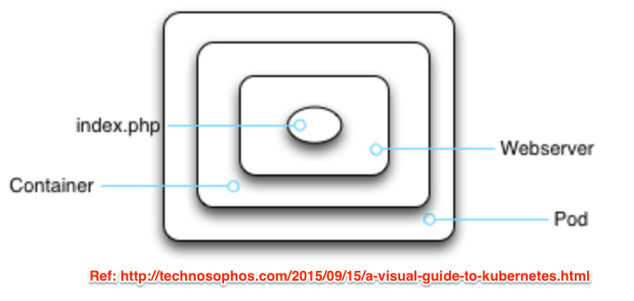
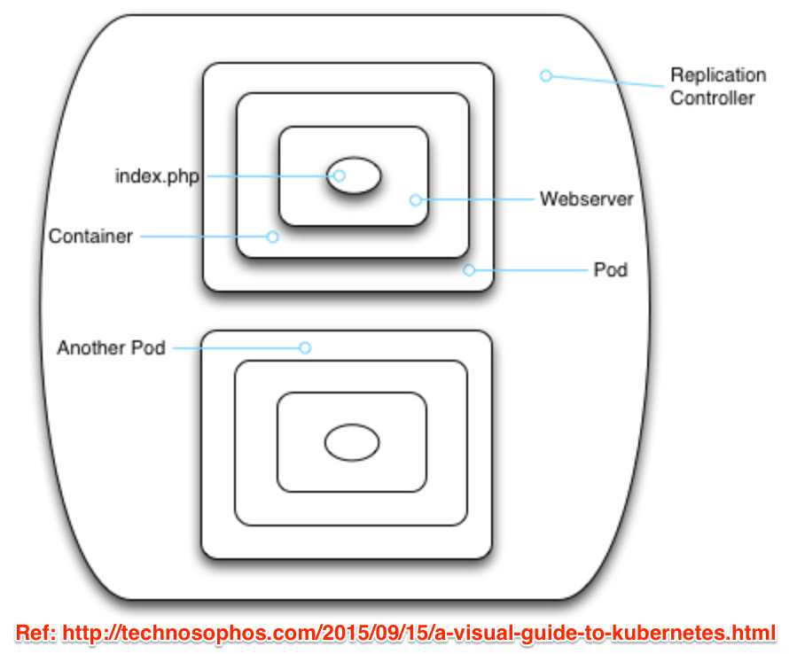
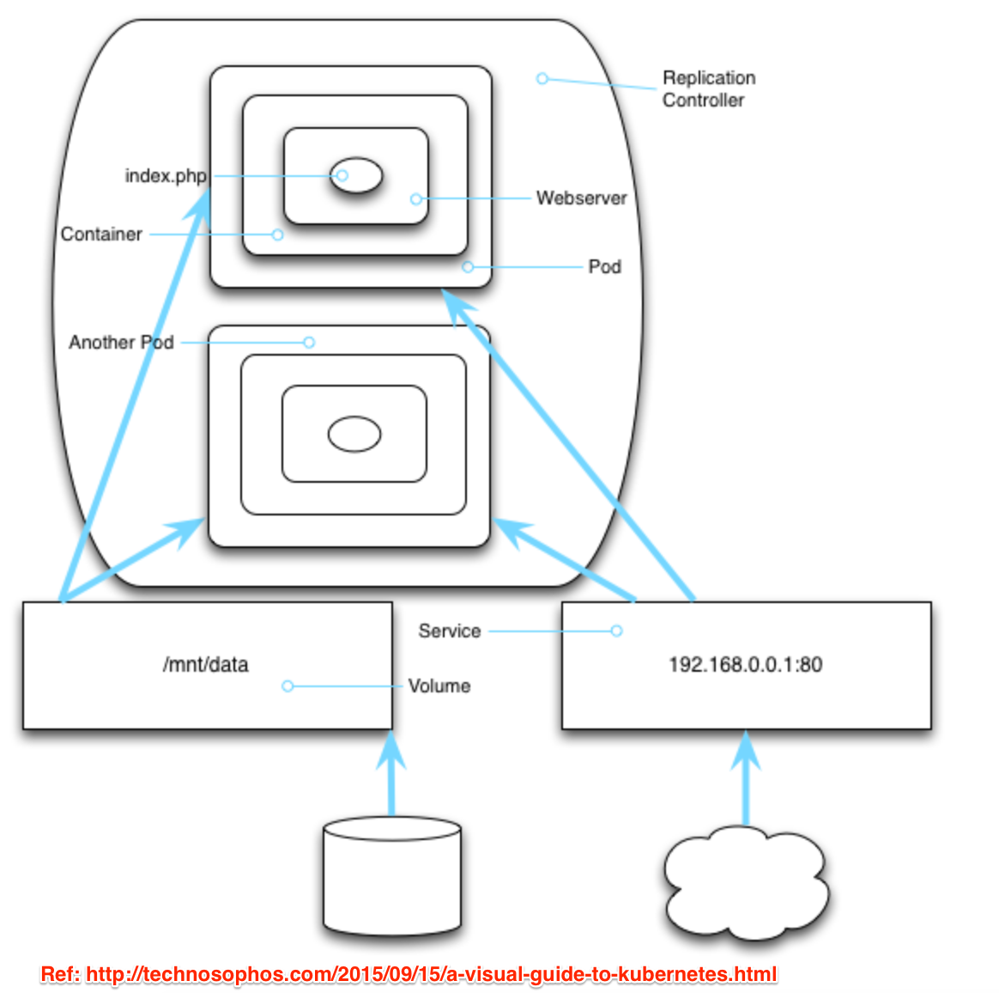
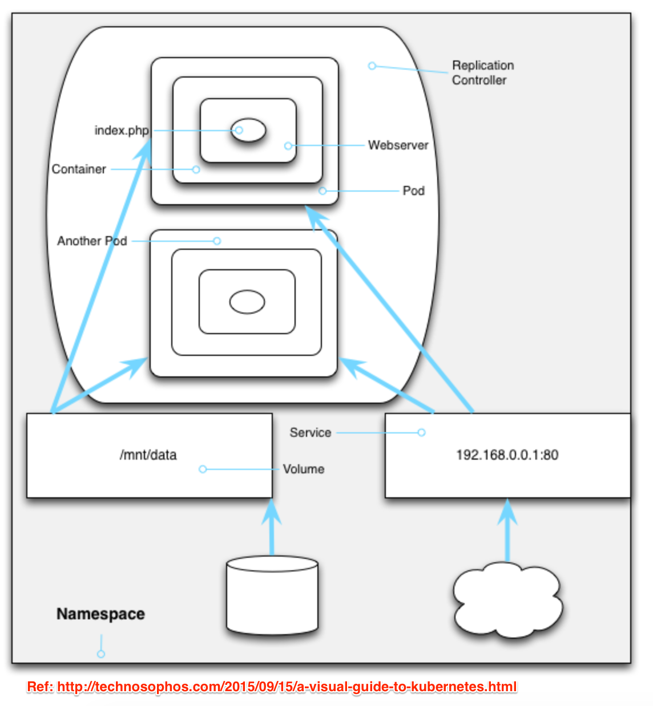

# Kubernetes 
- an open-source
- a system for automating deployment and scaling
- a container management technology (manage containerized applications)
- developed in Google lab & hosted by Cloud Native Computing Foundation (CNCF)

## Terminology 
### 1. Pods
A Pod is a logical wrapper around running containers which hold an application.
For example, a Pod may have mysql database container, microservices container,
and wordpress container running together as an application.



### 2. Replication Controllers
Replication controllers ensure that a specific number of pod replicas are
running at any one time. It manages cluster (group of pods), scale up cluster (by
creating extra pod copies), scale down cluster (by removing a few copies). It
can monitor each pod and if one is unresponsive or misbehave, it can kill that
one and bring on a suitable replacement.



### 3. Services
Services defines a logical set of Pods and a policy by which to access them over 
the network. For example, a service preserves IP addresses and ports so that DNS
names can map to the same thing.


### 4. Volume
A place to store data that lives longer than a pod for an application.



### 5. Namespaces
A way of encapsulating pods, replication controllers, services and volumes into
big group called namespace. It isolate its contents from everybody's stuff. 



## Application Deployment
- Build your docker image file
- Push the image to docker registry (see build.sh)
- To run build.sh `bash build.sh -v 0.0.2`
- To see deployment file `vim kube/academy-mysql-deployment.yml`
- To replace/create deployment file in kuberneties server `kubectl
  [replace/create] -f kube/academy-mysql-deployment.yml`
- See all deployments `kubectl get deployments`
- See all pods `kubectl get pods`
- See detail of deployed application `kubectl describe deploy [application_name]`
- Create/Replace/Apply services same as deployment `kubectl create -f
  kube/academy-mysql-service.yml`
- See all services `kubectl get services`
- `kubectl get pod academy-3544580744-2fq3e -o yaml`
- `kubectl get pvc -o yaml`
- Execute container bash:w
- `kubectl exec -it academy-3544580744-2fq3e bash`

## Check resources
- Get quota name `kubectl get quota`
- Describe `kubectl describe quota <quota-name>`
```
Name:            compute-resources
Namespace:       webops-uat
Resource         Used    Hard
--------         ----    ----
limits.cpu       1850m   4
limits.memory    3584Mi  8Gi
pods             4       8
requests.cpu     1200m   2
requests.memory  2560Mi  4Gi
```
