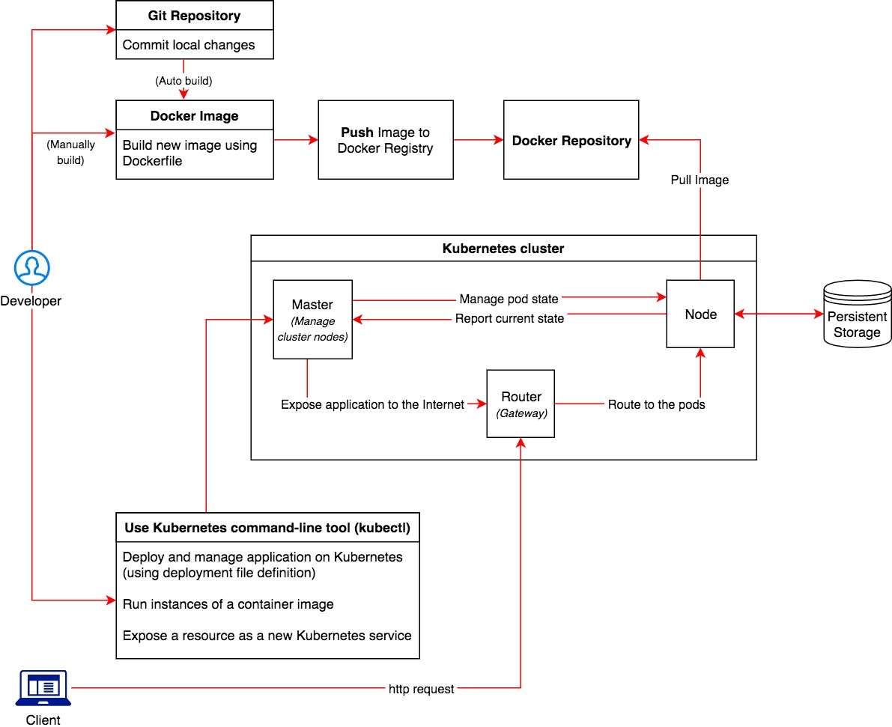

# Kubernetes 
- an open-source
- a system for automating deployment and scaling
- a container management technology (manage containerized applications)
- developed in Google lab & hosted by Cloud Native Computing Foundation (CNCF)

## Setup Kubernetes
To setup kubernetes in your machine refer [Kubernetes
Setup](./kubernetes-setup.md) page.

## Kubernetes terminology
To understand kubernetes terminology refer [Kubernetes
Terminology](./kubernetes-setup.md#user-content-terminology) page.

## Deploying an application on Kubernetes (Process)


## Kubectl basics
Kubectl is use to get information about deployed application and their environments.
Below are the most common kubectl commands:

### `kubectl get <deployments|pods|services>`
List resources

**Examples:**
```
  # List all pods in ps output format.
  kubectl get pods

  # List all pods in ps output format with more information (such as node name).
  kubectl get pods -o wide

  # Get a specified deployment file configuration in YAML output format.
  kubectl get deployment <deployment_file_name> -o yaml

  # List a single replication controller with specified NAME in ps output format.
  kubectl get replicationcontroller web

  # List a single pod in JSON output format.
  kubectl get -o json pod web-pod-13je7

  # List all replication controllers and services together in ps output format.
  kubectl get rc,services

  # List one or more resources by their type and names.
  kubectl get rc/web service/frontend pods/web-pod-13je7

  # List all resources with different types.
  kubectl get all
```

### `kubectl describe <deployments|pods|services>`
Show details information about a resource.

**Example**
```
  # Describe a node
  kubectl describe nodes kubernetes-node-emt8.c.myproject.internal

  # Describe a pod
  kubectl describe pods/nginx

  # Describe a pod identified by type and name in "pod.json"
  kubectl describe -f pod.json
```

### `kubectl log <OPTIONS>`
Print the logs for a container in a pod or specified resource. 

**Example**
```
  # Return snapshot logs from pod nginx with only one container
  kubectl logs nginx

  # Return snapshot logs for the pods defined by label app=nginx
  kubectl logs -lapp=nginx

  # Display only the most recent 20 lines of output in pod nginx
  kubectl logs --tail=20 nginx

  # Return snapshot logs from first container of a job named hello
  kubectl logs job/hello
```

### `kubectl <create|replace|apply> -f path/to/yaml/config/file`
`kubectl create` To create a resource from a file

`kubectl apply` To apply a configuration to a resource by filename

`kubectl replace` To replace a resource by filename

**Example**
```
  # Create a pod using the data in pod.json.
  kubectl create -f ./pod.json

  # Apply the configuration in pod.json to a pod.
  kubectl apply -f ./pod.json

  # Replace a pod using the data in pod.json.
  kubectl replace -f ./pod.json

  # Force replace, delete and then re-create the resource
  kubectl replace --force -f ./pod.json
```  

### `kubectl exec`
Execute a command on a container in a pod.

**Example:**
```
  # Execute bash in specified pod in interactive mode
  kubectl exec -it <POD_NAME> bash

  # Get output from running 'date' from pod 123456-7890, using the first container by default
  kubectl exec 123456-7890 date
```

## An example of Conceptual Kubernetes Deployment

- Build your docker image file
- Push the image to docker registry (see build.sh)
- To run build.sh `bash build.sh -v 0.0.2`
- To see deployment file `vim kube/academy-mysql-deployment.yml`
- To replace/create deployment file in kuberneties server `kubectl
  [replace/create] -f kube/academy-mysql-deployment.yml`
- See all deployments `kubectl get deployments`
- See all pods `kubectl get pods`
- See detail of deployed application `kubectl describe deploy [application_name]`
- Create/Replace/Apply services same as deployment `kubectl create -f
  kube/academy-mysql-service.yml`
- See all services `kubectl get services`
- `kubectl get pod academy-3544580744-2fq3e -o yaml`
- `kubectl get pvc -o yaml`
- Execute container bash:w
- `kubectl exec -it academy-3544580744-2fq3e bash`
 

